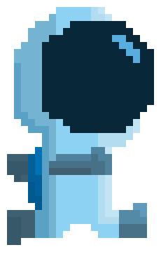

👋 ¡Hola! Soy **Anderson Gómez García**  
🔧 **Programador Full-Stack** (Front-End & Back-End)

___________________________________________________________________________________________________________________________________________________________________________________________________________________________
# 📖 Sobre mí

Tengo afinidad por el desarrollo tecnológico, explorando tanto el diseño como el backend y bases de datos. Formado en SENA y Univalle. Me gusta escuchar primero a mi equipo y proponer soluciones claras y sin ambigüedades.
 ___________________________________________________________________________________________________________________________________________________________________________________________________________________________

# 💻 Habilidades  

• **Lenguajes:** HTML5 • CSS3 • JavaScript • PHP • C# • SQL • Git  
• **Frameworks:** Bootstrap • Tailwind • React • .NET • Laravel  
• **Herramientas:** Figma • PostgreSQL • XAMPP • GitHub • VSCode
___________________________________________________________________________________________________________________________________________________________________________________________________________________________

# 🚀 Proyectos Destacados  
• Hotel el Descanso  
• Casa Hotel Mateguadua  
• Reproductor de Música  
• Clínica RIE  
• Pool Care  
• Mascota Feliz  
• DigitCol  
• AnderWeb
___________________________________________________________________________________________________________________________________________________________________________________________________________________________

# ✉️ Contacto  
📧 andersongomezgarcia111@gmail.com  
📱 +57 318 583 6788  
🌎 Tulúa, Valle del Cauca, Colombia
